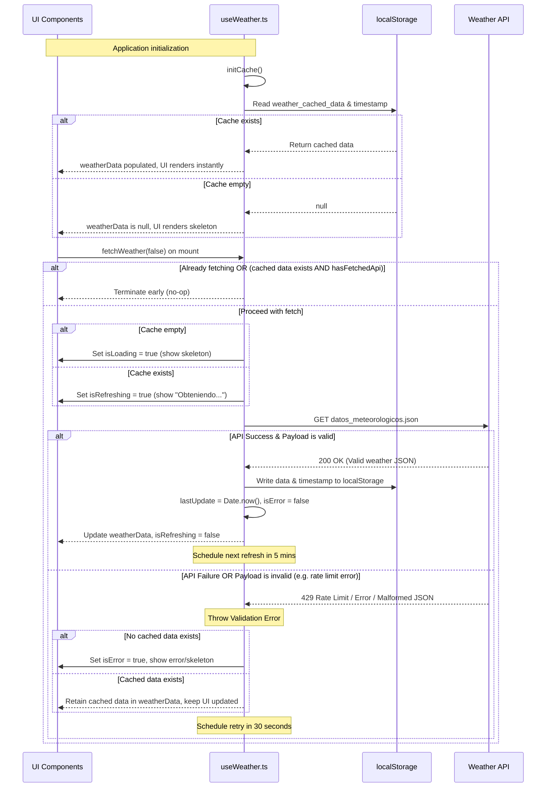

# Technical Design: Weather Code Undefined Mitigation & Caching

This technical design document outlines the implementation strategy to prevent runtime crashes in weather UI components caused by API rate limits, server errors, or invalid structures. It introduces robust payload validation, persistent local cache fallback, defensive optional chaining, and reactive update/retry loops.

---

## 1. Reference Material & Specifications
- **Proposal**: [proposal-weather-code-undefined.md](file:///Users/baldboy/desarrollo/nijar/app.turismonijar.es/openspec/designs/proposal-weather-code-undefined.md)
- **Specification**: [weather-code-undefined.md](file:///Users/baldboy/desarrollo/nijar/app.turismonijar.es/openspec/specs/weather-code-undefined.md)
- **Related Composable**: [useWeather.ts](file:///Users/baldboy/desarrollo/nijar/app.turismonijar.es/app/composables/useWeather.ts)
- **UI Components**: 
  - [TiempoPortada.vue](file:///Users/baldboy/desarrollo/nijar/app.turismonijar.es/app/components/TiempoPortada.vue)
  - [TiempoDetalleModal.vue](file:///Users/baldboy/desarrollo/nijar/app.turismonijar.es/app/components/TiempoDetalleModal.vue)

---

## 2. Architecture Decisions

### 2.1 Caching Mechanism: `localStorage`
- **Choice**: Native client-side `localStorage`.
- **Rationale**:
  - The weather data payload is relatively small (~5-10 KB), well within the 5MB limit of `localStorage`.
  - Unlike asynchronous options (e.g. IndexedDB), `localStorage` is synchronous. This allows immediate data restoration on application setup without delaying the hydration phase or causing brief layouts shifts.
  - Safe wrappers (`try-catch`) will be added to ensure the application falls back gracefully to in-memory refs if `localStorage` access is blocked (e.g., private browsing, sandboxed mobile containers).

### 2.2 Defensive Computed Fallbacks
- All computed properties exposed by `useWeather` and utilized inside components will access nested data with optional chaining (`weatherData.value?.current?.weather_code`).
- Safe default fallbacks (like `0` for numeric values, `'sunny'` for weather state, and empty strings for descriptions) prevent Javascript runtime errors (`TypeError`) if properties are missing or modified.

### 2.3 Module-Level Timer & Focus/Visibility Listeners
- **Singleton Pattern**: Active intervals/timeouts and status refs (`isRefreshing`, `lastUpdate`) are defined at the module-level in `useWeather.ts`. This ensures that multiple component instantiations do not spawn concurrent timer loops or trigger redundant fetches.
- **Dynamic Intervals**:
  - Succeeded fetch: triggers a 5-minute background refresh timer.
  - Failed/invalid fetch: triggers a 30-second background retry timer.
- **Window Focus / Tab Visibility**: Trigger background refreshes on focus or visibility change events when `document.visibilityState === 'visible'`. This keeps weather current without polling when the app is backgrounded.

---

## 3. Data Flow

The flow of initialization, UI rendering, and background updates is described below:



---

## 4. TypeScript Interfaces & Data Contracts

We will enhance safety by defining an optional `error` key in the `WeatherData` interface to safely model error payloads returned by rate-limited gateways:

```typescript
interface WeatherCurrent {
  time: string
  interval: number
  temperature_2m: number
  relative_humidity_2m: number
  is_day: number
  precipitation: number
  rain: number
  weather_code: number
  wind_speed_10m: number
  wind_direction_10m: number
}

interface WeatherHourly {
  time: string[]
  temperature_2m: number[]
  relative_humidity_2m: number[]
  precipitation_probability: number[]
  rain: number[]
  weather_code: number[]
  wind_speed_10m: number[]
  wind_direction_10m: number[]
  uv_index: number[]
  is_day: number[]
}

interface WeatherDaily {
  time: string[]
  weather_code: number[]
  temperature_2m_max: number[]
  sunrise: string[]
  sunset: string[]
  uv_index_max: number[]
  precipitation_probability_max: number[]
  wind_speed_10m_max: number[]
}

interface WeatherData {
  latitude: number
  longitude: number
  generationtime_ms: number
  utc_offset_seconds: number
  timezone: string
  timezone_abbreviation: string
  elevation: number
  current: WeatherCurrent
  hourly: WeatherHourly
  daily: WeatherDaily
  error?: boolean // API payload key for error states
  reason?: string // API payload key for error detail
}
```

---

## 5. Precise File Changes

### 5.1 `app/composables/useWeather.ts`
- Declare module-scoped variables:
  ```typescript
  const weatherData = ref<WeatherData | null>(null)
  const lastUpdate = ref<number | null>(null)
  const isRefreshing = ref(false)
  const isLoading = ref(false)
  const isError = ref(false)

  let refreshTimer: NodeJS.Timeout | null = null
  let isInitialized = false
  let hasFetchedApi = false

  const WEATHER_DATA_KEY = 'weather_cached_data'
  const WEATHER_TIME_KEY = 'weather_last_update_time'
  ```
- Implement `initCache()` to read from storage safely:
  ```typescript
  function initCache() {
    if (isInitialized || !process.client) return
    isInitialized = true
    try {
      const cached = localStorage.getItem(WEATHER_DATA_KEY)
      const time = localStorage.getItem(WEATHER_TIME_KEY)
      if (cached) {
        weatherData.value = JSON.parse(cached)
      }
      if (time) {
        lastUpdate.value = parseInt(time, 10)
      }
    } catch (err) {
      console.warn('Failed to load weather cache from localStorage:', err)
    }
  }
  ```
- Implement `scheduleNext(success: boolean)` to register timers:
  ```typescript
  function scheduleNext(success: boolean) {
    if (!process.client) return
    if (refreshTimer) clearTimeout(refreshTimer)
    const delay = success ? 5 * 60 * 1000 : 30 * 1000
    refreshTimer = setTimeout(() => {
      fetchWeather(true)
    }, delay)
  }
  ```
- Modify `fetchWeather(force = false)`:
  - If `isRefreshing.value` or `isLoading.value` is true, return early.
  - If `weatherData.value && !force && hasFetchedApi`, return early.
  - If `!weatherData.value`, set `isLoading.value = true`. Otherwise, set `isRefreshing.value = true`.
  - Validate response: Check that `data.error !== true && data.current && data.daily`.
  - In catch-block: Set `isError.value = true` only if `weatherData.value` is null. Schedule next retry.
- Add event listeners:
  ```typescript
  if (process.client) {
    const handleVisibilityOrFocus = () => {
      if (document.visibilityState === 'visible') {
        fetchWeather(true)
      }
    }
    window.addEventListener('focus', handleVisibilityOrFocus)
    document.addEventListener('visibilitychange', handleVisibilityOrFocus)
  }
  ```
- Apply optional chaining and fallbacks to all computed properties:
  - `isDay`: `weatherData.value?.current?.is_day === 1`
  - `temperature`: `weatherData.value?.current?.temperature_2m ?? 0`
  - `windSpeed`: `weatherData.value?.current?.wind_speed_10m ?? 0`
  - `humidity`: `weatherData.value?.current?.relative_humidity_2m ?? 0`
  - `uv`: use `weatherData.value?.daily?.uv_index_max?.[0] ?? 0`
  - `imgTiempo`: check `weatherData.value?.current?.weather_code`
  - `weatherDescription`: check `weatherData.value?.current?.weather_code`
  - `weatherState`: check `weatherData.value?.current?.weather_code`, return `'sunny'` by default.

### 5.2 `app/components/TiempoPortada.vue`
- Change conditional render check for loading vs loaded state:
  - Loaded state container: `v-if="weatherData"`
  - Loading skeleton state: `v-else-if="isLoading || !weatherData"`
- Create `formattedLastUpdate` computed property:
  ```typescript
  const formattedLastUpdate = computed(() => {
    if (!lastUpdate.value) return ''
    const date = new Date(lastUpdate.value)
    const hours = date.getHours().toString().padStart(2, '0')
    const minutes = date.getMinutes().toString().padStart(2, '0')
    return `${hours}:${minutes}`
  })
  ```
- Inject status indicator inside the loaded summary card container, below the temperature row:
  ```vue
  <div class="text-xs opacity-80 mt-1 text-shadow-sm select-none">
    <span v-if="isRefreshing">{{ t('weather.refreshing') }}</span>
    <span v-else-if="lastUpdate">{{ t('weather.last_update', { time: formattedLastUpdate }) }}</span>
  </div>
  ```

### 5.3 `app/components/TiempoDetalleModal.vue`
- Apply safe optional chaining in the template to avoid crashes if keys are somehow missing:
  - `weatherData?.daily?.uv_index_max?.[0]`
  - `weatherData?.current?.wind_direction_10m`
  - `weatherData?.current?.precipitation`
  - `weatherData?.daily?.sunrise?.[0]`
  - `weatherData?.daily?.sunset?.[0]`
  - `weatherData?.current?.time`
- Add status message below the weather condition description in the hero block:
  ```vue
  <div class="text-xs opacity-80 mt-1 text-shadow-sm select-none">
    <span v-if="isRefreshing">{{ t('weather.refreshing') }}</span>
    <span v-else-if="lastUpdate">{{ t('weather.last_update', { time: formattedLastUpdate }) }}</span>
  </div>
  ```
- Protect the bottom timestamp update text:
  ```vue
  <span class="text-[10px] text-white/70 mt-2 font-mono uppercase tracking-widest text-center">
    {{ t('last_update_label') }} {{ weatherData?.current?.time ? weatherData.current.time.slice(11, 16) : '' }}
  </span>
  ```

### 5.4 `i18n/locales/es.json` & `i18n/locales/en.json`
- Add localized values under the `weather` namespace:
  - **es.json**:
    ```json
    "weather": {
      ...
      "last_update": "Última actualización: {time}",
      "refreshing": "Obteniendo información..."
    }
    ```
  - **en.json**:
    ```json
    "weather": {
      ...
      "last_update": "Last update: {time}",
      "refreshing": "Refreshing..."
    }
    ```

---

## 6. Testing & Verification Strategy

Since there is no automated testing runner configured in the workspace, testing will rely on manual visual checks, simulation mode, and manual network failure mocking.

### 6.1 Simulation Mode Verification
`TiempoPortada.vue` contains a `simulationMode` ref. When toggled to `true`, the developer can stack-render multiple mock weather cards representing different weather conditions (Sunny, Cloudy, Rainy) in both day and night states.
- **Action**: Toggle `simulationMode.value = true` inside `TiempoPortada.vue`.
- **Expectation**: Verify that the modal and components render all cards correctly without throwing exceptions. Ensure the status indicator correctly displays values during simulation.

### 6.2 Manual API Error Simulation
To mock API errors and rate-limiting payloads:
1. **Mocking Rate Limiting**: Temporarily alter `fetchWeather()` in `useWeather.ts` to fetch from a mock URL or return a simulated rate limit object `{"error": true, "reason": "Too many concurrent requests"}`.
   - **Verification**:
     - Ensure the UI loads and displays cached values instantly from `localStorage` if present.
     - Verify that `weatherData` is not overwritten by the error payload.
     - Confirm that a retry timeout is scheduled and triggers after 30 seconds.
2. **Mocking Offline State**: Disable internet connection or block the domain `baldboy.es` using Chrome DevTools Network Tab.
   - **Verification**:
     - Verify that the app does not crash.
     - Verify that if a cache exists, it is displayed.
     - Verify that the console logs the warning message.

### 6.3 Verification Checklist
- [ ] No application crashes occur when the Weather API returns an error payload.
- [ ] The loader skeleton only renders when there is no weather data (neither live nor cached).
- [ ] Successful background updates refresh the `localStorage` values (`weather_cached_data` and `weather_last_update_time`).
- [ ] Status messages are correctly translated in English and Spanish.
- [ ] Resuming app focus/visibility triggers background refresh.

---

## 7. Rollout & Rollback Plan
- **Rollout**: Implement changes in a single slice targeting the composable, components, and locale files.
- **Rollback**: Run:
  ```bash
  git checkout -- app/composables/useWeather.ts app/components/TiempoPortada.vue app/components/TiempoDetalleModal.vue i18n/locales/es.json i18n/locales/en.json
  ```
